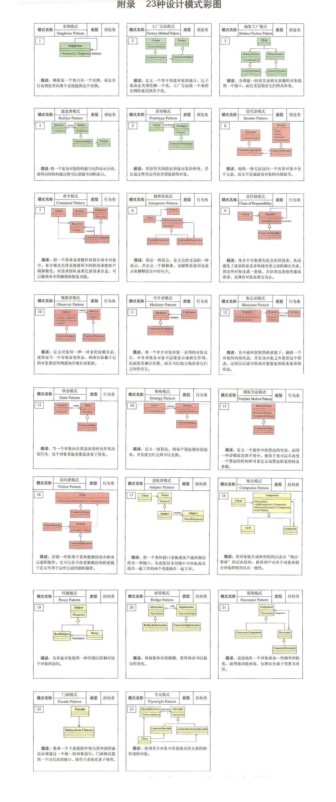

* [设计的七大原则](docs/设计的七大原则.md)

### 1. 创建型(Creational) 【共5个】
主要解决如何灵活创建对象或者类的问题，共5个。
1. [单例模式, Singleton Pattern](docs/01.Singleton.单例模式.md)
2. [工厂方法模式, Factory Method Pattern](docs/02.FactoryMethod.工厂模式.md)
   1. **工厂方法模式**
   2. **抽象工厂模式**
   3. 简单工厂模式 (不在GOF23中设计模式之中，但是应用广泛)
3. [抽象工厂模式, Abstract Factory Pattern]()
4. [原型模式, Prototype Patter](docs/03.Prototype.原型模式.md)
5. [构造者模式, Builder Pattern](docs/04.BuilderPattern.建造者模式.md)

### 2. 结构型(Structural)
结构型设计模式主要用于将类或对象进行组合从而构建灵活而高效的结构，共7个。
1. 适配器模式, Adaptor
2. 桥接模式, Bridge
3. 组合模式, Composite
4. [装饰者模式 Decorator Patter](docs/06.DecoratorPattern.装饰者模式.md)
5. 外观模式, Facade
6. 享元模式, Flyweight
7. [代理模式 Proxy Pattern](docs/05.ProxyPattern.代理模式.md)
   1. 静态代理
   2. 动态代理(JDK代理)
   3. Cglib代理

### 3. 行为型(Behavioral)
行为型设计模式主要解决类或者对象之间互相通信的问题，共11个。
1. 责任链模式, Chain of Responsibility
2. 命令模式, Command
3. 解释器模式, Interpreter
4. 迭代器模式, Iterator
5. 中介者模式, Mediator
6. 备忘录模式, Memento
7. 观察者模式, Observer
8. 策略模式, Strategy
9. 状态模式, State
10. [模板方法模式(Template method pattern)](docs/07.TemplateMethodPattern.模板方法模式.md)
11. 访问者模式, Visitor

## Reference:
* Youtube: 尚硅谷 设计模式 韩顺平
* [尚硅谷_韩顺平_图解Java设计模式](docs/尚硅谷_韩顺平_图解Java设计模式.pdf)
* [尚硅谷_韩顺平_图解Java设计模式_课件](docs/尚硅谷_韩顺平_图解Java设计模式_课件.pdf)
* [设计模式知识体系详解(pdai)](https://pdai.tech/md/dev-spec/pattern/1_overview.html)
* [永不磨灭的设计模式](https://shusheng007.top/2021/09/07/design-pattern/)
* [shusheng007/design-patterns](https://github.com/shusheng007/design-patterns)
* [稀土掘金-小旋锋](https://juejin.cn/user/3896324938269278/posts)
* [Source Making: Design Patterns](https://sourcemaking.com/design_patterns)

## 附件: 23种设计模式彩图
