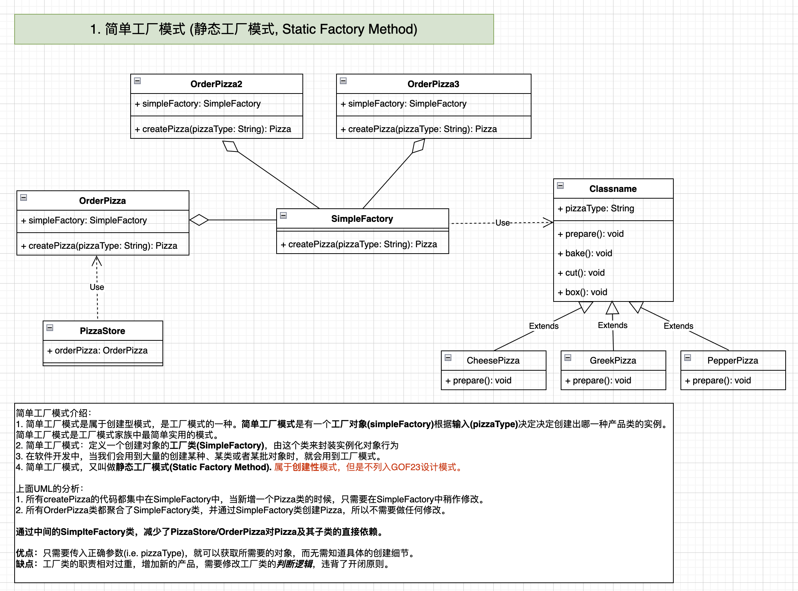
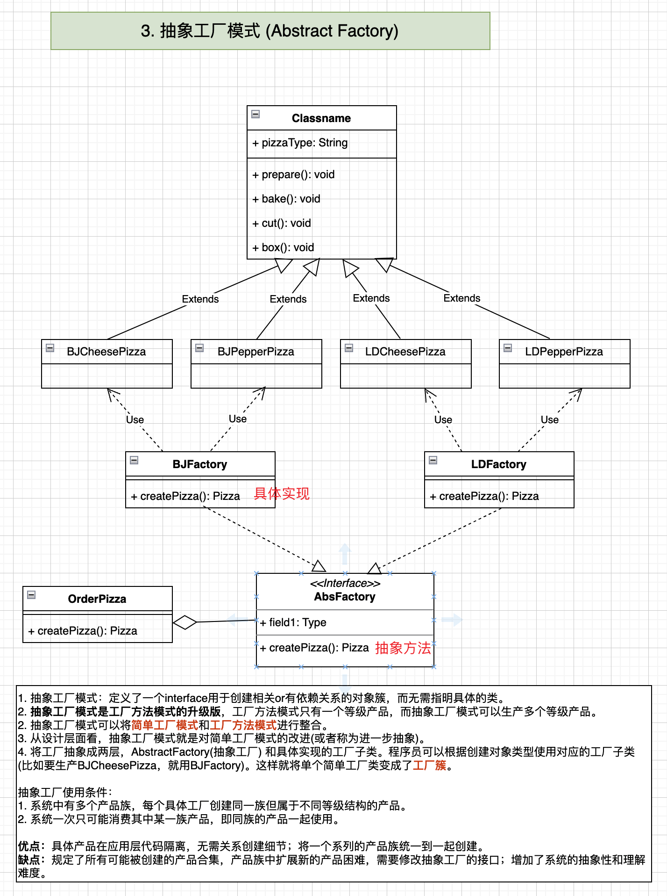

## 简单工厂模式

工厂模式系列：
1. 传统方式(并不是工厂模式，此处列出来只为比较)
2. 简单工厂模式
3. 工厂方法模式

### 需求分析
需求：要便于Pizza种类的扩展，便于维护。
1. Pizza的种类可以有很多，比如GreekPizza，CheesePizza，PepperPizza等
2. Pizza的制作过程有：prepare，bake，cut，box
3. 完成PizzaStore订购Pizza的功能

### 0. 传统方式的优缺点

1. 优点是比较容易理解，简单易操作。
2. 缺点是违反了设计模式的OCP原则，即**对扩展开放，对修改关闭**。即当给类增加新的功能时，尽量不修改or少修改代码。
3. 比如当增加新的Pizza中类时，`OrderPizza1.java`, `OrderPizza2.java`等都要做修改。

### 1. 简单工厂模式

简单工厂模式定义了一个创建对象的类，由这个类来封装实例化对象的行为。

### 2. 工厂方法模式

将Pizza实例化功能抽象成抽象方法，在不同的口味点餐类中具体实现。在抽象类(OrderPizza)中定义一个抽象方法，由子类(BJOrderPizza, LDOrderPizza)决定要实例化的类(i.e. BJCheesePizza or LDCheesePizza)。
工厂方法模式**将对象实例化推迟到子类**中。

### 3. 抽象工厂模式

在抽象工厂模式中，工厂被抽象成了两层，一层是AbstractFactory，另一层是负责具体实现的工厂子类。