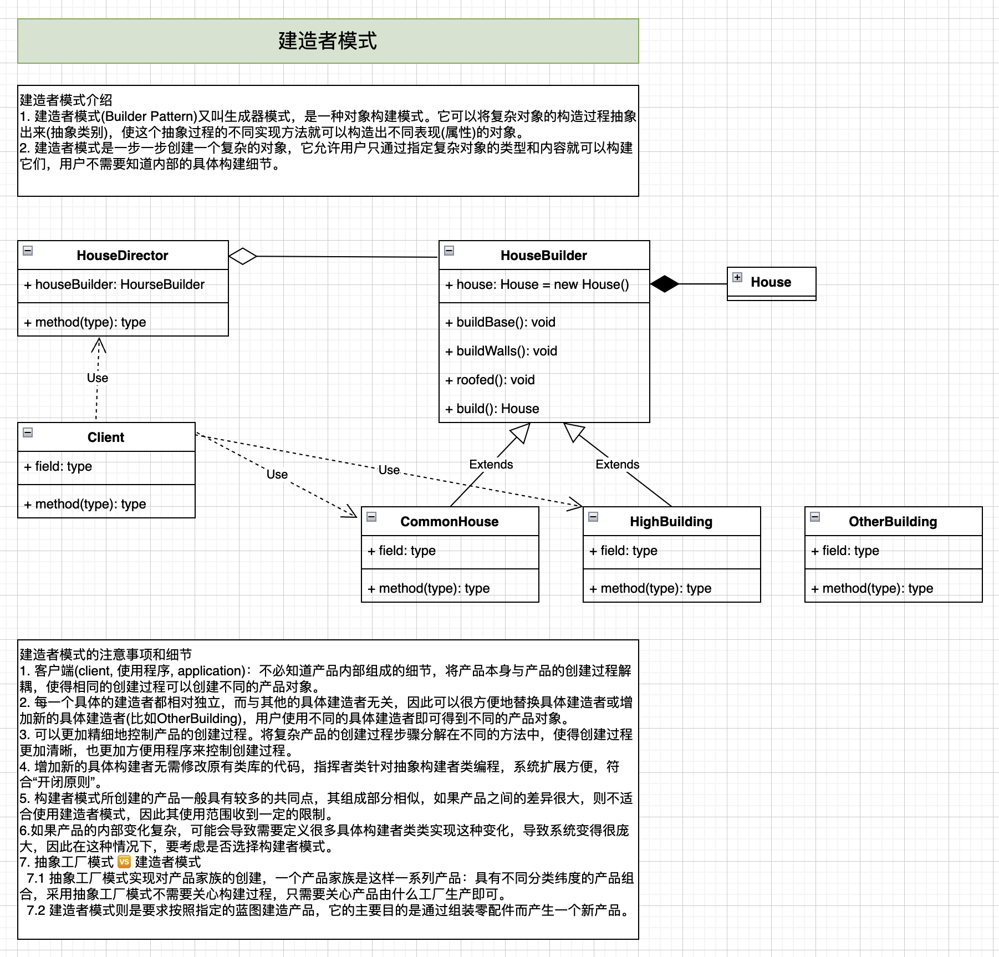

## BuilderPattern

### 传统方式

### 构造者模式

### 定义
> The intent of the Builder design pattern is to separate the construction of a complex object from its representation. By doing so the same construction process can create different representations

将一个复杂对象的**构建**与其**表示**分离，使得*同样的构建过程*可以创建不同的表示。

### 使用场景
当一个类的构造函数参数超过4个，而且这些参数有些是可选的参数，考虑使用**构造者模式**。

### JDK源码
[`java.lang.StringBuilder`](https://github.com/openjdk/jdk17/blob/master/src/java.base/share/classes/java/lang/StringBuilder.java)

## Reference
* Youtube 尚硅谷 图解设计模式 055~059
* [Runoob.com 建造者模式](https://www.runoob.com/design-pattern/builder-pattern.html)
* [Runoob.com 设计模式之建造者(Builder)模式](https://www.runoob.com/w3cnote/builder-pattern.html)
* [Runoob.com 设计模式：Builder模式](https://www.runoob.com/w3cnote/builder-pattern-2.html)
* [秒懂设计模式之建造者模式（Builder pattern）](https://zhuanlan.zhihu.com/p/58093669)
* [生成器模式](https://refactoringguru.cn/design-patterns/builder)
* [一篇文章就彻底弄懂建造者模式(Builder Pattern)](https://www.jianshu.com/p/3d1c9ffb0a28)
* [轻松理解设计模式：4.建造者模式（创建型）](https://juejin.cn/post/7023936575541084168)
* [我要打十个！详解建造者模式（builder pattern）](https://www.cnblogs.com/happyone/p/12513098.html)
* ✅[秒懂设计模式之建造者模式（Builder pattern）](https://shusheng007.top/2020/02/16/builder-pattern/) (Telescoping constructor pattern: 折叠构造函数模式)
* ✅[设计模式 | 建造者模式及典型应用](https://juejin.cn/post/6844903678457937933)