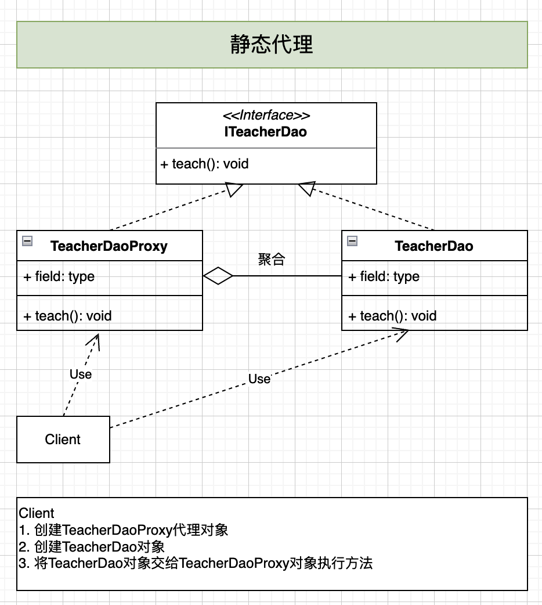
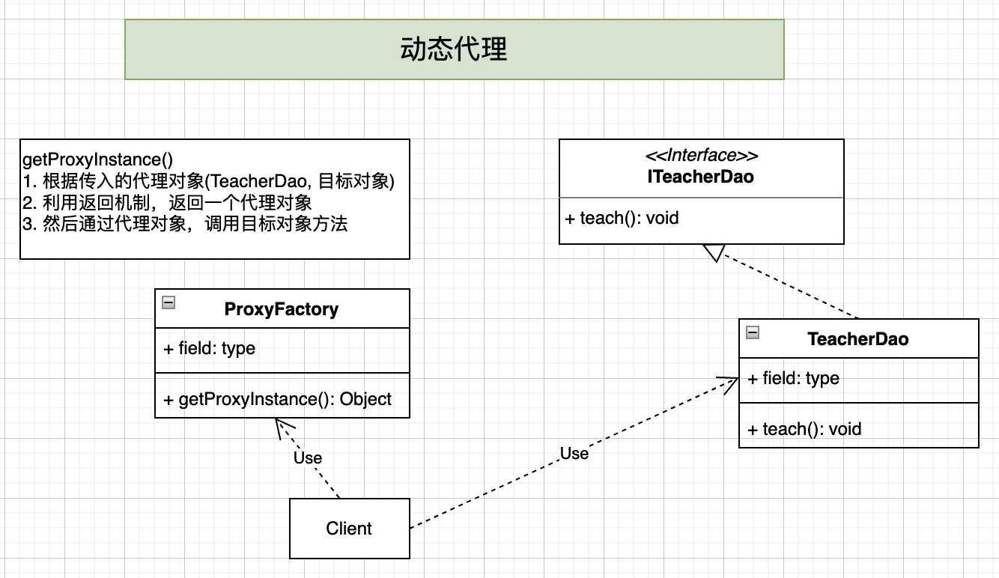
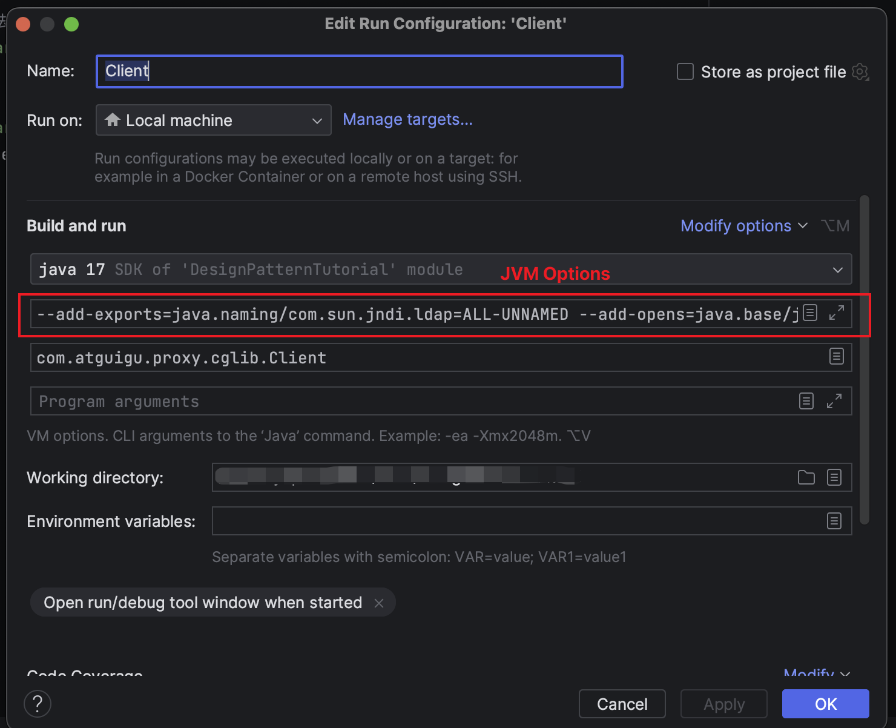

## 代理模式
1. 代理模式: 为一个**对象(target)提供一个替身**，以控制对这个对象的访问。即通过代理对象(proxy)访问目标对象(target)。
2. 这样做的好处是: 可以在目标对象实现的基础上，增强额外的功能操作，即扩展目标对象的功能。
3. 被代理的对象可以是远程对象、创建开销大的对象or需要安全控制的对象。
4. 代理模式有不同的形式，主要有三种:
   1. 静态代理
   2. 动态代理(JDK代理，接口代理)
   3. Cglib代理(可以在内存动态创建对象，而不需要实现接口，也可以属于动态代理的范畴)

**代理模式是为了增强功能，扩展功能，通过代理对象来增强和扩展目标对象的功能**

## 1. 静态代理

静态代理在使用时，需要定义接口或者父类，被代理对象(即目标对象)与代理对象一起实现相同的接口或者是继承相同的父类。

**优点:**
1. 在不修改目标对象的前提下，通过代理目标对象对目标功能扩展

**缺点:**
1. 因为代理对象需要与目标对象实现一样的接口，所以会有很多代理类
2. 一旦接口增加方法，目标对象与代理对象都需要维护


## 2. 动态代理

1. 代理对象不需要实现接口，但是目标对象需要实现接口，否则不能用动态代理
2. 代理对象的生成是利用JDK的反射API，动态地在内存中构建代理对象
3. 动态代理也叫做: JDK代理，接口代理

### 2.1 JDK中生成代理对象的API
1. 代理类：`java.lang.reflect.Proxy`
2. JDK实现代理只需要使用`newProxyInstance`方法，该方法需要三个参数
   * `new Object newProxyInstance(ClassLoader loader, Class<?> interfaces, InvocationHandler h)`


* [java.lang.reflect.Proxy](https://docs.oracle.com/en/java/javase/17/docs/api/java.base/java/lang/reflect/Proxy.html)


## 3. Cglib代理
1. 静态代理和动态代理(JDK代理)都要求目标对象(target)实现一个接口，但是有时候目标对象只是一个单独的对象，并没有实现任何的接口，这时候可以使用目标对象的**子类**实现代理，这就是Cglib代理
2. Cglib代理也叫做子类代理，它是在内存中构建一个子类对象从而实现对目标对象功能扩展，有些书也将Cglib代理归属到动态代理。
3. Cglib是一个强大的高性能的代码生成包。它可以在运行期间扩展Java类与实现Java接口。它广泛的被许多AOP的框架使用，例如Spring AOP，实现方法拦截。
4. 在AOP编程中，如何选择代理模式:
   1. 目标对象**需要**实现接口: 用动态代理(JDK代理)
   2. 目标对象不需要实现接口: Cglib代理
5. Cglib包的底层是通过使用字节码处理框架ASM来转换字节码并生成新的类

要求:
1. 引入cglib的jar包
2. 在内存中动态构建子类，注意代理的类不能为final类，否则报错`java.lang.IllegalArgumentException`
3. 目标对象的方法如果为`final/static`，那么就不会被拦截，即不会执行目标对象额外的业务。

⚠️注意:
1. 因为JDK17引入了新特性，包括`403: Strong Encapsulate JDK Internals 强封装JDK的内部API，无法暴力反射`
   1. [Reflection StringTest](https://github.com/ylqi007/JavaTutorial/blob/main/src/main/java/com/atguigu/reflection/interview/StringTest.java)
2. 如何解决？添加JVM OPTIONS
   1. [Java 17 InaccessibleObjectException](https://medium.com/@rajvirsinghrai/java-17-inaccessibleobjectexception-bf030a348e48)
   2. [Java 16 and 17 compatibility #191](https://github.com/cglib/cglib/issues/191)
   3. [Idea中为java程序添加启动参数（含：VM options、Program arguments、Environment variable）](https://blog.51cto.com/Saintmm/5573298)

Step 1: 按照上面的帖子添加JVM OPTIONS


Step 2: Run `main()` method again，然后可以看到Run Console中执行的代码如下
```shell
/Library/Java/JavaVirtualMachines/amazon-corretto-17.jdk/Contents/Home/bin/java --add-exports=java.naming/com.sun.jndi.ldap=ALL-UNNAMED --add-opens=java.base/java.lang=ALL-UNNAMED --add-opens=java.base/java.lang.invoke=ALL-UNNAMED --add-opens=java.base/java.io=ALL-UNNAMED --add-opens=java.base/java.security=ALL-UNNAMED --add-opens=java.base/java.util=ALL-UNNAMED --add-opens=java.management/javax.management=ALL-UNNAMED --add-opens=java.naming/javax.naming=ALL-UNNAMED -javaagent:/Users/userName/Library/Application Support/JetBrains/Toolbox/apps/IDEA-U/ch-0/231.9161.38/IntelliJ IDEA.app/Contents/lib/idea_rt.jar=60625:/Users/userName/Library/Application Support/JetBrains/Toolbox/apps/IDEA-U/ch-0/231.9161.38/IntelliJ IDEA.app/Contents/bin -Dfile.encoding=UTF-8 -classpath /Users/userName/Work/IDEA/DesignPatternTutorial/target/classes:/Users/userName/.m2/repository/cglib/cglib/3.3.0/cglib-3.3.0.jar:/Users/userName/.m2/repository/org/ow2/asm/asm/7.1/asm-7.1.jar com.atguigu.proxy.cglib.Client
```
* Note: I replaced real user name with `userName`


## 4. 代理模式的变体
1. 防火墙代理: 内网通过代理穿透防火墙，实现对公网的访问
2. 缓存代理: 比如，当请求图片文件等资源时，先到缓存代理取，如果取到则OK，如果取不到资源，再到公网或者数据库取，然后缓存。
3. 远程代理: 远程对象的本地代表，通过它可以把远程对象当作本地对象来调用。远程代理通过网络和真正的远程对象沟通信息。 
4. 同步代理: 主要使用在多线程编程中，完成多线程间同步工作。


## Reference
* Youtube: 尚硅谷 设计模式 韩顺平
* [代理模式](https://www.runoob.com/design-pattern/proxy-pattern.html) (例子)
* [代理模式](https://refactoringguru.cn/design-patterns/proxy) (例子)
* [Java 代理模式详解](https://javaguide.cn/java/basis/proxy.html)
* [「设计模式」🏳️‍🌈代理模式（Proxy）](https://juejin.cn/post/7088115791052144654)
* [6. 代理模式](https://design-patterns.readthedocs.io/zh-cn/latest/structural_patterns/proxy.html)
* [Proxy（代理模式）](https://github.com/ascoders/weekly/blob/master/%E8%AE%BE%E8%AE%A1%E6%A8%A1%E5%BC%8F/178.%E7%B2%BE%E8%AF%BB%E3%80%8A%E8%AE%BE%E8%AE%A1%E6%A8%A1%E5%BC%8F%20-%20Proxy%20%E4%BB%A3%E7%90%86%E6%A8%A1%E5%BC%8F%E3%80%8B.md)
* [设计模式（四）——搞懂什么是代理模式](https://zhuanlan.zhihu.com/p/72644638)