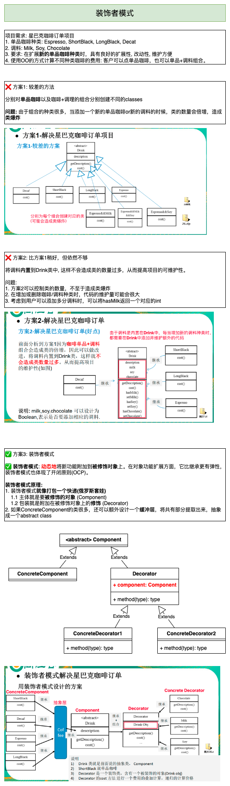
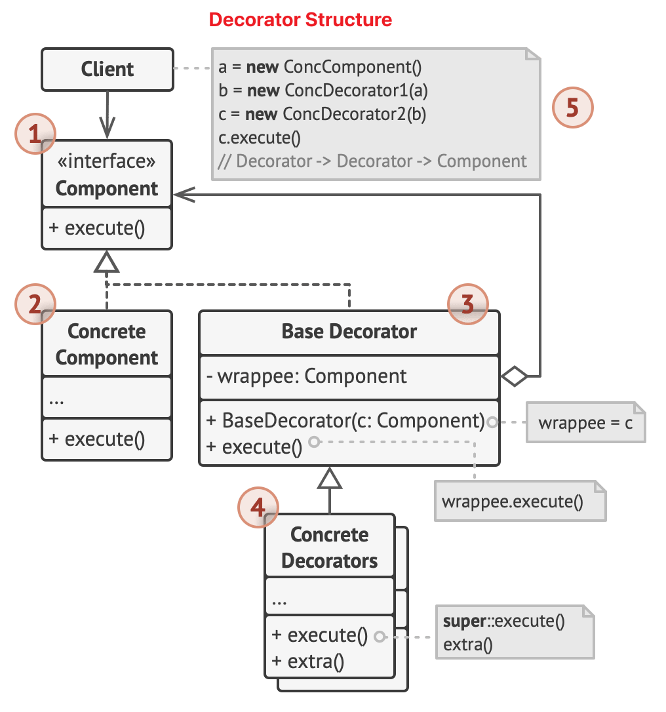
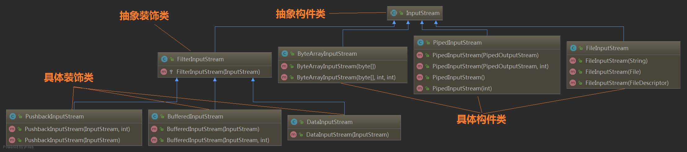
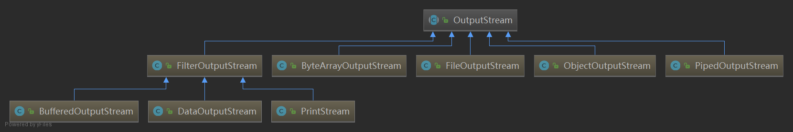
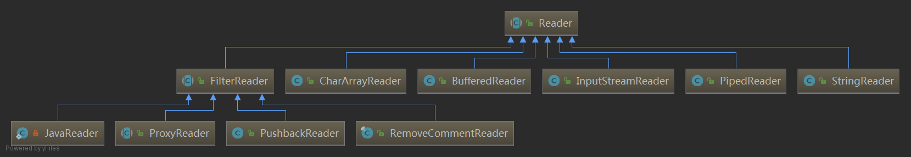
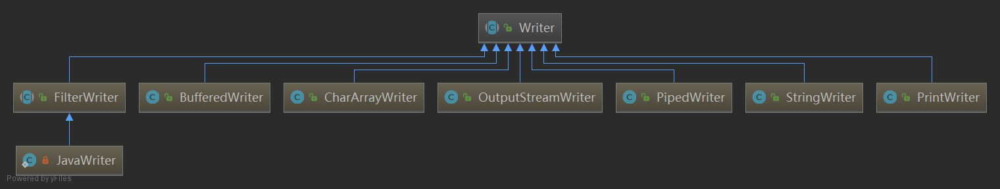

# Decorator Pattern (装饰者模式)
装饰者模式也称为包装模式(Wrapper Pattern), 属于结构型设计模式。
从**功能**上而言，decorator能很好的描述这个模式，但是从**结构**上看，wrapper的说法更加贴切。装饰者模式将一个对象嵌入到另一个对象之中，实际上相当于这个对象被另一个对象包装起来，形成了一条包装链。请求随着这条链依次传递到所有的对象，每个对象都有处理这条请求的机会。

## 模式动机 & 定义
### 1. 动机
要实现给一个类or对象增加行为，一般有两种方式
1. 继承机制: 通过继承一个父类，可以使子类在拥有自身方法的同时还拥有父类的方法。但这种方法是**静态的**，用户不能控制增加行为的方式和时机。(高耦合，会产生更多的子类，从而引起类爆炸)
2. 关联机制: 将一个类对象嵌入到另一个对象中，由另一个对象决定是否调用嵌入对象的行为以便扩展自己的行为，我们称这个被嵌入的对象为装饰器(Decorator)。(降耦，不会创造更多的子类)

装饰模式可以对客户透明地、动态地给一个对象附加上更多的责任，换言之，客户端并不会觉得对象在装饰前和装饰后由什么不同。装饰模式可以在不需要创造更多子类的情况下，将对象的功能加以扩展。

### 2. 定义
装饰模式(Decorator Pattern): 动态地给一个对象增加一些额外的职责(Responsibility)，就增加对象功能来说，装饰模式比生成子类（继承）实现更为灵活。其别名也可以称为包装器(Wrapper)，与适配器模式的别名相同，但它们适用于不同的场合。

## 装饰模式结构

1. **部件(Component):** 声明**封装器**和**被封装对象**的公用接口。
2. **具体部件(Concrete Component):** 被封装对象所属的类。它定义了基础行为，但装饰类可以改变这些行为。
3. **基础装饰(Base Decorator):** 拥有一个指向被封装对象的引用成员变量。该变量的类型被声明为通用的部件接口，这样它可以应用具体的部件和装饰。装饰器基类会将所有的操作委派给被封装的对象。
4. **具体装饰(Concrete Decorators):** 定义了可以动态添加到部件的额外行为。具体装饰类会重写基础装饰类的方法，并在调用父类方法之前或之后进行额外的行为。
5. **客户端(Client):** 可以使用多层装饰封装部件，只要它能够使用通用接口与所有对象互动即可。

## 装饰模式适用场景
1. 如果你希望在无需修改代码的情况下即可使用对象， 且希望在运行时为对象新增额外的行为， 可以使用装饰模式。
2. 装饰能将业务逻辑组织为层次结构， 你可为各层创建一个装饰， 在运行时将各种不同逻辑组合成对象。 由于这些对象都遵循通用接口， 客户端代码能以相同的方式使用这些对象。
3. 如果用继承来扩展对象行为的方案难以实现或者根本不可行， 你可以使用该模式。
4. 许多编程语言使用`final`关键字来限制对某个类的进一步扩展。 复用最终类已有行为的唯一方法是使用装饰模式： 用封装器对其进行封装。

## 装饰模式在Java IO中的应用
`InputStream`类图

`OutputStream`类图

`Reader` and `Writer` 类图

## 装饰者模式 🆚 代理模式
这两种模式都描述了为对象提供一定程度上的间接引用，它们的实现部分都保留了对另外一个对象的引用，并且向那个对象发送请求。

**区别:**
* **代理模式**目的是，当直接访问本地不方便or不符合需求时，为这个本地提供了一个替代者。**本体**定义了关键功能，而**代理**提供or拒绝对它的访问，或者**在访问本体之前做一些额外的事情**。
* **装饰者模式**的作用就是为对象**动态加入行为**。

**代理模式**通常是一层代理-->本体的引用，而**装饰者模式**经常会形成一条条长长的装饰链。

## Reference
* [装饰模式](https://refactoringguru.cn/design-patterns/decorator)
* [秒懂设计模式之装饰者模式（Decorator Pattern）](https://shusheng007.top/2020/02/16/decorator-pattern/)
* :white_check_mark:[设计模式 | 装饰者模式及典型应用](https://juejin.cn/post/6844903681322647566)  (装饰模式在Java IO中的应用，以及在Spring cache, Spring session, Mybatis缓存中的应用)
* [装饰模式——看 JDK 和 Spring 是如何杜绝继承滥用的](https://ost.51cto.com/posts/682)
* [3. 装饰模式](https://design-patterns.readthedocs.io/zh-cn/latest/structural_patterns/decorator.html)
* [【java设计模式】（5）---装饰者模式（案例解析）](https://www.cnblogs.com/qdhxhz/p/9251083.html)
* [Java 设计模式之装饰者模式](https://segmentfault.com/a/1190000016508992)
* [设计模式 --装饰者模式](https://github.com/aermin/blog/issues/68)
* [装饰者模式(Decorator) ](https://leezhian.com/web/design/decorator)
* [设计模式中的俄罗斯套娃：装饰者（Decorator）模式](https://xxgblog.com/2021/10/19/decorator-pattern/) (HttpServletRequest套娃)
* [聊一聊装饰者模式](https://www.51cto.com/article/740706.html)
* [设计模式--装饰者模式](https://www.jianshu.com/p/a11de1059145)
* [什么是装饰者模式](https://coderunning.fun/2019/12/07/design-pattern/%E8%A3%85%E9%A5%B0%E8%80%85%E6%A8%A1%E5%BC%8F/)
* [设计模式——3、装饰者模式](http://zjwave.com/article/44.html)
* [装饰者模式](https://gentryhuang.com/posts/a708a60d/)