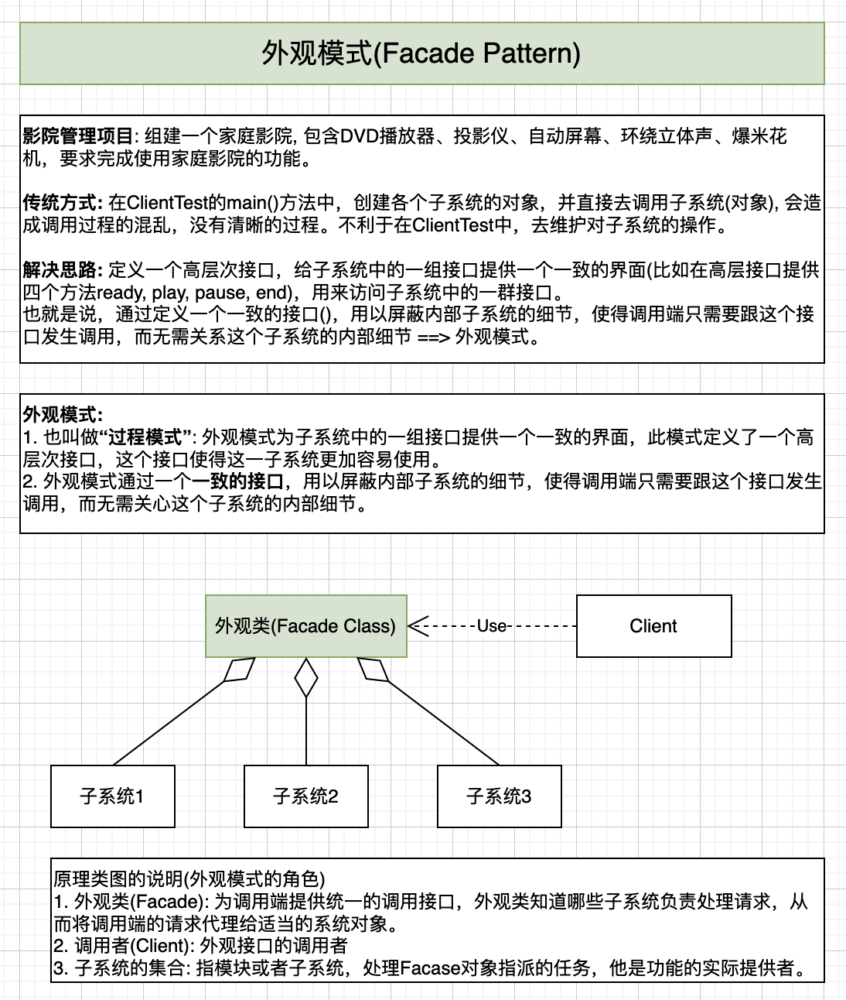

# Facade Pattern, 外观模式/面板模式 (Structural)

## 1. 定义 & 使用场景
**定义:**
> 提供一个**高层次的接口**，使得子系统更易于使用

**使用场景:**
> 当你的程序有很多个模块，或者说子系统。你希望给用户提供一个统一的操作界面类，而不是让用户分别与这些模块交互。

**何时使用Facade**
总结一下哈
* 系统设计阶段，要有分层的概念
* 开发阶段，随着系统越来越庞大，可适当增加外观Facade提供简单的接口，减少依赖关系
* 维护老系统，为了屏蔽业务的复杂性（祖传代码，能不动就不动，谁动谁背锅 哈哈哈） ，可以提供一个Facade类，让新对接的系统对接Facade类，Facade负责与遗留代码进行交互，

## 外观模式优缺点 (Pros and Cons)
* Pros: 你可以让自己的代码独立于复杂子系统。
* Cons: 外观可能成为与程序中所有类都耦合的上帝对象。

## 与其他模式的关系
1. **外观模式**为现有对象定义了一个新接口，**适配器模式**则会试图运用已有的接口。适配器通常只封装一个对象，外观通常会作用于整个对象子系统上。
2. 当只需对客户端代码隐藏子系统创建对象的方式时， 你可以使用**抽象工厂模式**来代替外观。
3. **享元模式**展示了如何生成大量的小型对象， 外观则展示了如何用一个对象来代表整个子系统。
4. **外观**和**中介者模式**的职责类似：它们都尝试在大量紧密耦合的类中组织起合作。
   * 外观为子系统中的所有对象定义了一个简单接口，但是它不提供任何新功能。子系统本身不会意识到外观的存在。子系统中的对象可以直接进行交流。
   * **中介者**将系统中组件的沟通行为中心化。各组件只知道中介者对象，无法直接相互交流。
5. **外观类**通常可以转换为**单例模式类**， 因为在大部分情况下一个外观对象就足够了。
6. **外观**与**代理模式**的相似之处在于它们都缓存了一个复杂实体并自行对其进行初始化。代理与其服务对象遵循同一接口，使得自己和服务对象可以互换，在这一点上它与外观不同。

## Reference
* [秒懂设计模式之外观模式（Facade Pattern）](https://shusheng007.top/2021/09/08/facade-pattern/)
* [外观模式](https://refactoringguru.cn/design-patterns/facade)
* [外观模式](https://design-patterns.readthedocs.io/zh-cn/latest/structural_patterns/facade.html) (有个时序图)
* [设计模式 -结构型模式_门面模式(外观模式) Facade Pattern 在开源软件中的应用](https://developer.aliyun.com/article/1409045)