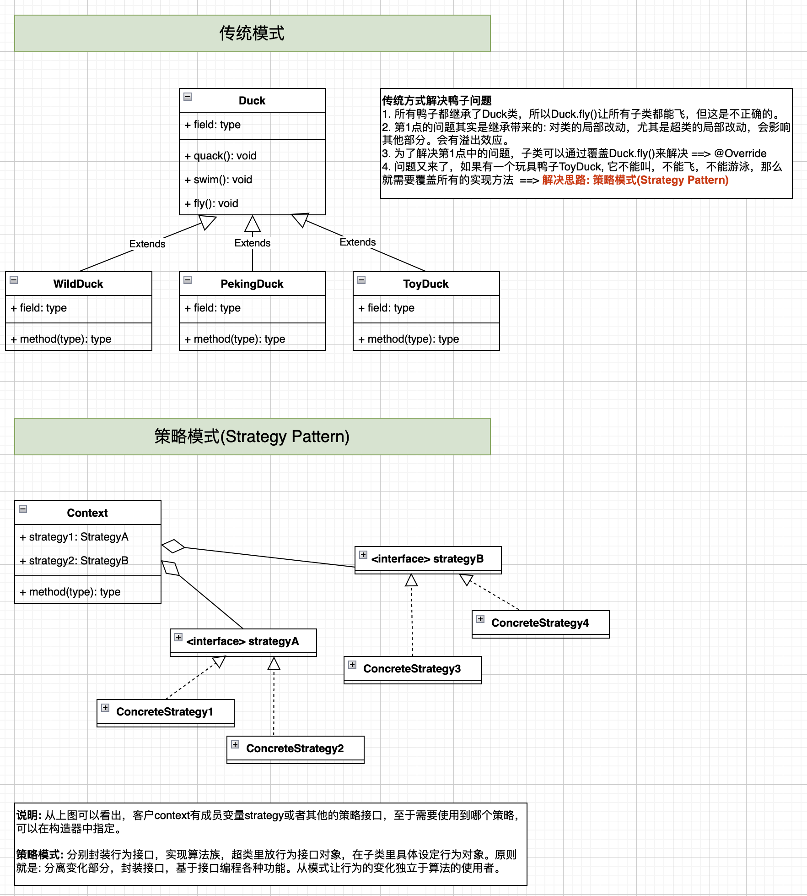

# 策略模式(Strategy Pattern)

## 1. 基本介绍
### 1.1 定义
> 策略模式定义了一系列的算法，并将每一个算法封装起来，使他们可以相互替换。

### 1.2 使用场景
当你写代码的时候发现**一个操作**有好多种实现方法，而你需要根据不同的情况使用`if-else`等分支结构来确定使用哪种实现方式的时候，想一想这个模式。

**策略模式:** 分别封装行为接口，实现算法族，超类里放行为接口对象，在子类里具体设定行为对象。原则就是：分离变化部分，封装接口，基于接口编程各种功能。此模式让行为的变化独立于算法的使用者。

## 优缺点
* **优点:** 降低了算法类的职责，使各个算法可以独立变化并互相替换。而且使得增加新的算法变的很容易，降低了对原有系统的侵入，最终使得程序可扩展可维护性增强。
* **缺点:** 所有设计模式的通病，类增多了，程序从局部来看变的更复杂了。

## 策略模式的注意事项和细节
1. 策略模式的关键是: 分析项目中变化部分和不变部分
2. 策略模式的核心思想是: 多用组合/聚合，少用继承；用行为类组合，而不是行为的继承。更有弹性。
3. 体现了"对修改的关闭，对扩展的开放"原则，客户端增加行为不用修改原有代码，只要增加一种策略(或者行为)即可，避免了使用多重转移语句(if...else if...else)
4. 提供了可以替换继承关系的办法: 策略模式将算法封装在独立的Strategy类中，使得客户可以独立于其他Context改变它，使它易于切换、易于理解、易于扩展。
5. 需要注意的是: 每添加一个策略就要增加一个类，当策略过多时会导致类树木庞大。

## Reference
* [秒懂设计模式之策略模式（Strategy Pattern）](https://shusheng007.top/2020/02/16/strategy-pattern/)
* [策略模式](https://refactoringguru.cn/design-patterns/strategy)
* [Java进阶篇设计模式之十一 ---- 策略模式和模板方法模式](https://www.cnblogs.com/xuwujing/p/9954263.html)