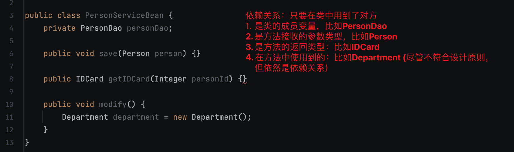
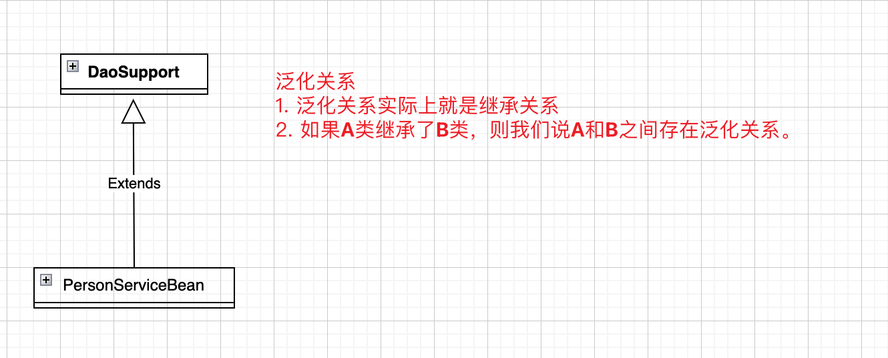
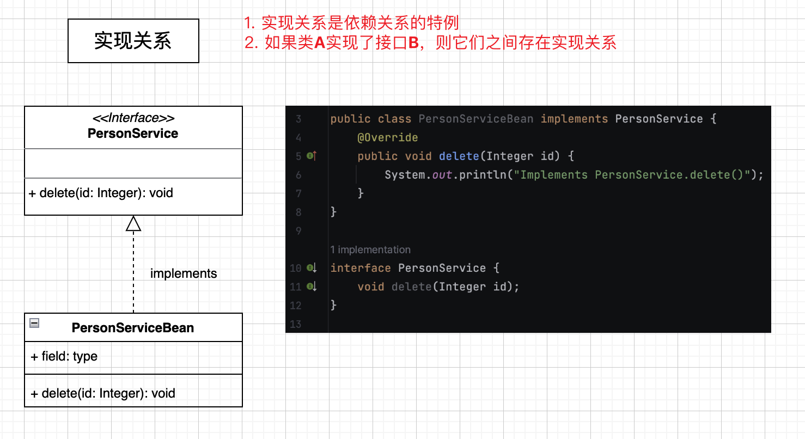
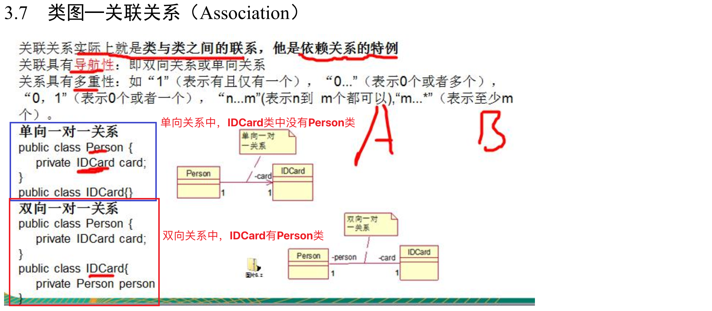
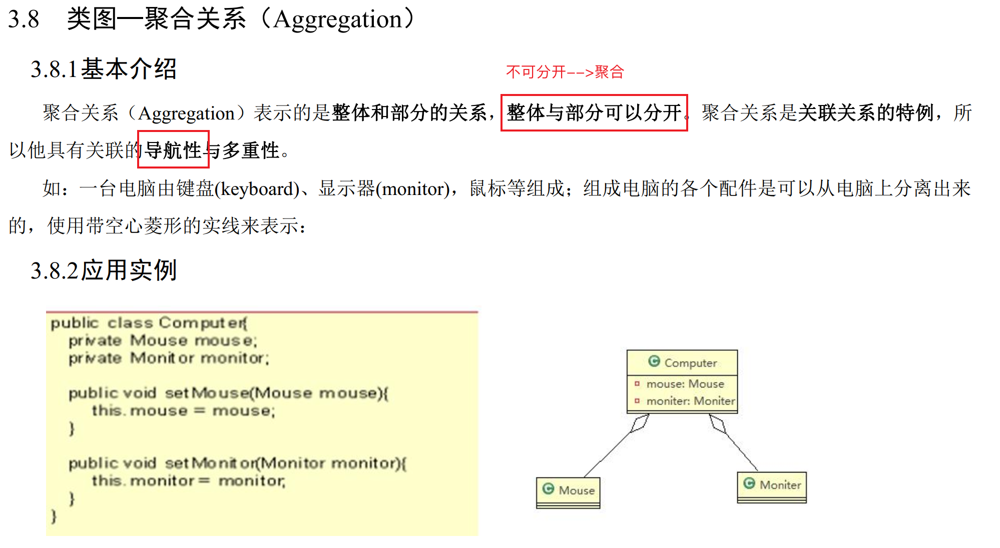
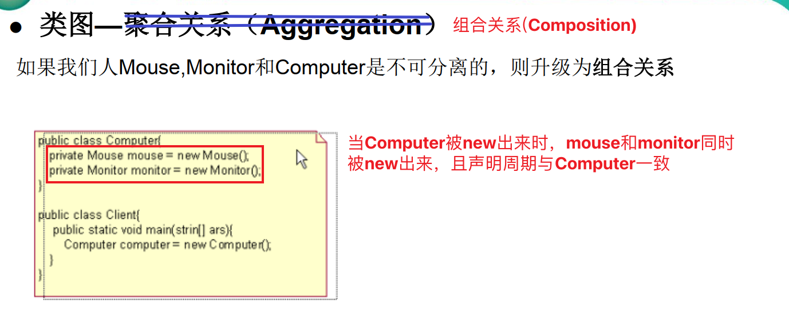
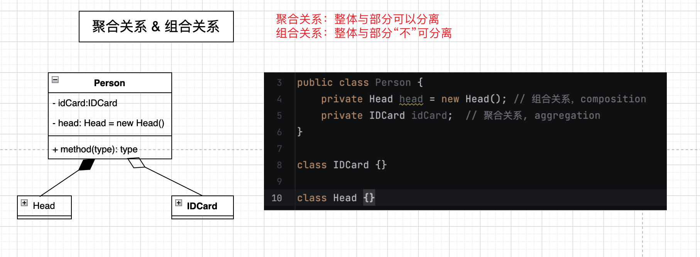

# UML图
1. 用于描述系统中类(对象)本身的组成和类(对象)之间的各种静态关系。
2. 类之间的关系：依赖，泛化(继承)，实现，关联，聚合与组合

### 1. 依赖(Dependency)
只要在类中用到了对方，那么它们之间就存在依赖关系。如果没有对方，连编译都无法通过。

### 2. 泛化(Generalization)
泛化关系实际上就是继承关系，它是*依赖关系*的特例。

### 3. 实现(Implementation)
**实现关系**实际上就是A类实现B类，它是*依赖关系*的特例。

### 4. 关联(Association)

### 5. 聚合(Aggregation)
整体与部分可以分离。

### 6. 组合(Composition)
整体与部分不可分离。

但是如果在程序中Person实体中定义了对IDCard进行级联删除，即删除Person时连同IDCard一起删除， 那么IDCard和Person就是**组合**了
